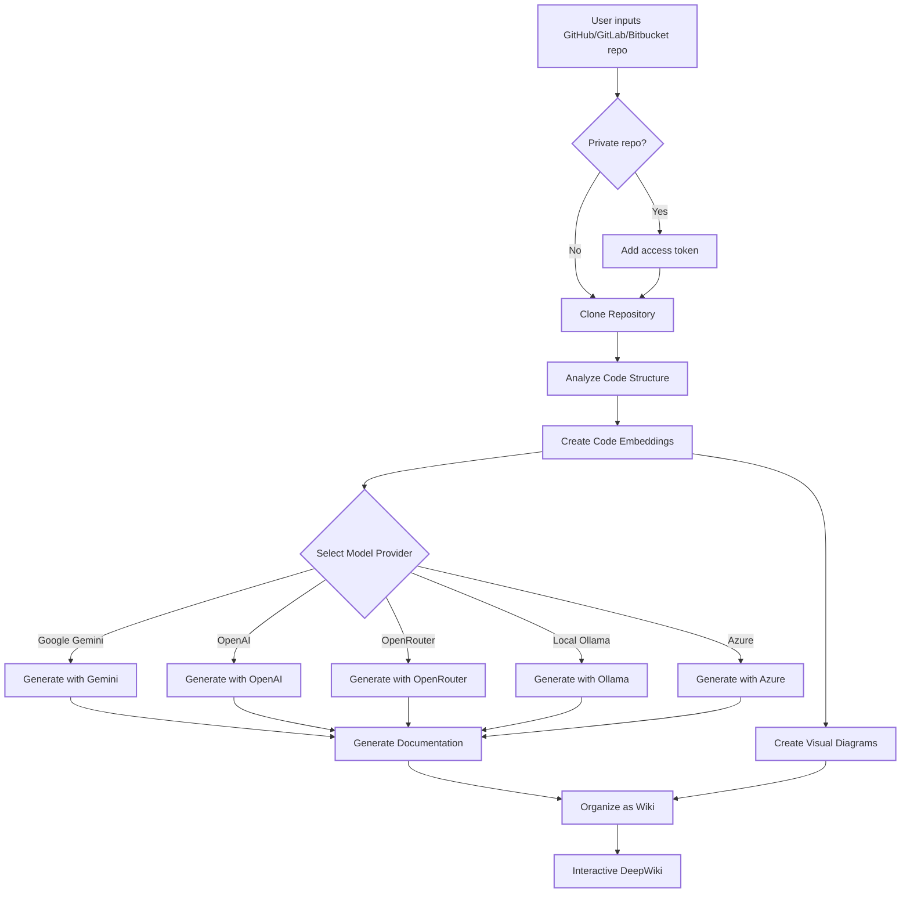

DeepWiki turns any GitHub, GitLab, Bitbucket, or local repository into a navigable wiki by combining repository analysis, vector embeddings, and AI generation. The result is a structured set of documentation pages — each with prose explanations and Mermaid diagrams — organized into sections that mirror the logical structure of the codebase.

<Note>
  DeepWiki supports public and private repositories on GitHub, GitLab, and Bitbucket, as well as local file system paths. For private repositories, see [Access private repositories](/features/private-repositories).
</Note>

## How the process works



DeepWiki performs seven steps for every generation request:

1. Clone and analyze the repository's file tree and code relationships
2. Embed the codebase into a vector index for retrieval
3. Select the AI provider and model you configured
4. Generate prose documentation using context-aware retrieval
5. Produce Mermaid diagrams that illustrate architecture and data flow
6. Organize pages into a structured wiki with sections
7. Cache the result so subsequent visits load instantly

## Generating a wiki

<Steps>
  <Step title="Enter the repository URL">
    Open DeepWiki at `http://localhost:3000` and paste a repository URL into the input field. Accepted formats include full HTTPS URLs (e.g. `https://github.com/openai/codex`) and local directory paths.
  </Step>
  <Step title="Select a provider and model">
    DeepWiki supports Google Gemini (default: `gemini-2.5-flash`), OpenAI (default: `gpt-5-nano`), OpenRouter, Azure OpenAI, and local Ollama models. Open the model selector to choose a different provider or enter a custom model identifier.
  </Step>
  <Step title="Configure filters (optional)">
    Expand the filter options to control which parts of the repository are indexed:
    - **Excluded dirs** — directories to skip entirely (e.g. `node_modules`, `dist`)
    - **Excluded files** — file patterns to omit (e.g. `*.lock`)
    - **Included dirs** — restrict indexing to specific directories only
  </Step>
  <Step title="Add an access token for private repos (optional)">
    Click **+ Add access tokens** and enter a personal access token if the repository is private. The token is passed per-request and is not stored server-side.
  </Step>
  <Step title="Click Generate Wiki">
    DeepWiki clones the repository, builds embeddings, and streams generated pages into the wiki view. Large repositories may take a minute or two.
  </Step>
</Steps>

## What a generated wiki contains

Each generated wiki includes:

- **Pages** — AI-written documentation for individual modules, packages, or concepts found in the repository
- **Sections** — logical groups that organize pages into a navigable hierarchy
- **Mermaid diagrams** — automatically generated flowcharts and sequence diagrams embedded in relevant pages

The `WikiStructureModel` returned by the API has the following shape:

```json
{
  "id": "string",
  "title": "string",
  "description": "string",
  "pages": [...],
  "sections": [...],
  "rootSections": [...]
}
```

Each page (`WikiPage`) carries an `id`, `title`, `content`, a list of `filePaths` the content was derived from, an `importance` level (`high`, `medium`, or `low`), and a list of `relatedPages` IDs.

## Wiki caching and refresh

Generated wikis are cached on disk under `~/.adalflow/wikicache/`. When you navigate to a repository URL that has already been processed, DeepWiki loads the cached version immediately. To regenerate the wiki with fresh content — for example after the repository has been updated — use the refresh option in the UI. Cached data persists across server restarts; Docker setups mount `~/.adalflow` to the host so caches survive container recreation.

## Language selection

DeepWiki can generate wiki content in multiple languages. A language selector in the UI lets you choose the output language before generation. Supported language codes include `en` (English), `zh` (Simplified Chinese), `zh-tw` (Traditional Chinese), `ja` (Japanese), `es` (Spanish), `kr` (Korean), `vi` (Vietnamese), `pt-br` (Brazilian Portuguese), `fr` (French), and `ru` (Russian).
